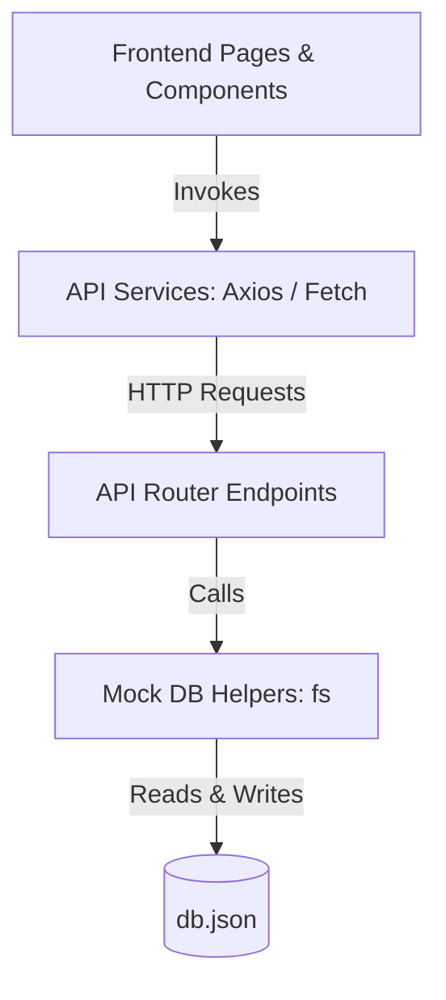

# 🚀 Next.js API Routes - Complete CRUD Operations Guide

Welcome to the **Next.js Users Management Directory**! This project demonstrates how to perform full **CRUD (Create, Read, Update, Delete)** operations inside Next.js using **App Router API Routes** and a simple JSON file (`db.json`) as a mock database.

This guide explains the entire project architecture and walks you through how all layers connect—from the database to the endpoints, services, and dynamic frontend components—in a very simple, step-by-step format.

---

## 📂 Project Architecture at a Glance

The project uses a structured, modular layer system to keep code clean and maintainable:



Here is a map of the files we will build:

| Layer | File Path | Purpose |
| :--- | :--- | :--- |
| **Data Types** | `src/types/index.ts` | Centralized TypeScript definitions and interfaces |
| **Mock Database** | `src/utils/db.ts` | Read and write utilities using Node.js filesystem (`fs`) |
| **API Client** | `src/services/userService/index.ts` | Centralized Axios/fetch wrappers for frontend requests |
| **API Routing** | `src/app/api/users/route.ts` | Backend handler for `GET` (all) and `POST` (create) |
| **API Routing** | `src/app/api/users/[userId]/route.ts` | Backend handler for `GET` (one), `PUT` (update), and `DELETE` (remove) |
| **UI Components** | `src/components/UserCard.tsx` | Listing item with dynamic **Delete Confirmation** |
| **UI Components** | `src/components/UserDetailCard.tsx` | Dynamic profile details card with inline **Update Form** |
| **Pages** | `src/app/users/page.tsx` | Server-rendered main listings directory |
| **Pages** | `src/app/users/[userId]/page.tsx` | Server-rendered user detail page wrapper |
| **Pages** | `src/app/adduser/page.tsx` | Client-side user creation page |

---

## 🛠️ Step-by-Step CRUD Implementation

---

### 📋 STEP 1: Centralized Typings & Interfaces
First, define what a "User" and other data shapes look like so the compiler knows how to check our code for errors.

* **Where to create**: `src/types/index.ts`
* **What it does**: Holds data interfaces used everywhere across both client and server pages.

```typescript
// 1. Core user structure matching db.json schema
export interface User {
  userId: number;
  userName: string;
  age: number;
  city: string;
  email: string;
}

// 2. Format returned when fetching all users
export interface ApiResponse {
  message: string;
  data: User[];
}

// 3. Typings for the users listing card component
export interface UserCardProps {
  user: User;
}

// 4. Typings for the detailed user card component
export interface UserDetailCardProps {
  initialUser: User;
}

// 5. Next.js typings for dynamic route parameter pages
export interface PageProps {
  params: Promise<{ userId: string }>;
}

// 6. Next.js typings for dynamic API route endpoints
export interface RouteParams {
  params: Promise<{ userId: string }>;
}
```

---

### 💾 STEP 2: The Mock Database Layer
Since we don't have a real SQL/NoSQL database installed, we store our list in a file called `db.json` at the root of the project.

* **Where to create**: `src/utils/db.ts`
* **What it does**: Uses Node's `fs` (FileSystem) library to read and overwrite our `db.json` file safely.

```typescript
import fs from "fs";
import path from "path";
import { User } from "@/types";

// Absolute path to the db.json file
const filePath = path.join(process.cwd(), "db.json");

// READ operation helper
export function getUsers(): User[] {
  try {
    if (!fs.existsSync(filePath)) return [];
    const fileData = fs.readFileSync(filePath, "utf-8");
    return JSON.parse(fileData);
  } catch (error) {
    console.error("Error reading db.json:", error);
    return [];
  }
}

// CREATE (Append Single) helper
export function saveUser(newUser: User): void {
  try {
    const users = getUsers();
    users.push(newUser);
    fs.writeFileSync(filePath, JSON.stringify(users, null, 2), "utf-8");
  } catch (error) {
    console.error("Error writing to db.json:", error);
  }
}

// UPDATE/DELETE (Overwrite Full Array) helper
export function saveUsers(allUsers: User[]): void {
  try {
    fs.writeFileSync(filePath, JSON.stringify(allUsers, null, 2), "utf-8");
  } catch (error) {
    console.error("Error writing to db.json:", error);
  }
}
```

---

### 🔌 STEP 3: API Route Endpoints (The Backend)
Now, build the actual web API routes that our frontend components can hit.

#### A. Main Users Endpoint (Create & Read All)
* **Where to create**: `src/app/api/users/route.ts`
* **What it does**: Handles fetching all users (`GET`) and creating a new user profile (`POST`).

```typescript
import { NextResponse } from "next/server";
import { getUsers, saveUser } from "@/utils/db";

// 1. GET ALL USERS: Responds with the full list
export async function GET() {
  const data = getUsers();
  return NextResponse.json({ message: "Success", data }, { status: 200 });
}

// 2. CREATE NEW USER: Receives fields, validates, and saves
export async function POST(req: Request) {
  let payload;
  try {
    payload = await req.json();
  } catch {
    return NextResponse.json({ message: "Invalid JSON body" }, { status: 400 });
  }

  const { userId, userName, email, age, city } = payload;

  // Validations: Check for empty values
  if (!userId || !userName || !email || !age || !city) {
    return NextResponse.json({ message: "All fields are required" }, { status: 400 });
  }

  const parsedUserId = Number(userId);
  const parsedAge = Number(age);

  if (isNaN(parsedUserId) || isNaN(parsedAge)) {
    return NextResponse.json({ message: "ID and Age must be numbers" }, { status: 400 });
  }

  // Duplicate Check: Check if ID or Email already exists
  const existingUsers = getUsers();
  if (existingUsers.some((u) => u.userId === parsedUserId)) {
    return NextResponse.json({ message: `ID #${parsedUserId} already exists` }, { status: 400 });
  }
  if (existingUsers.some((u) => u.email.toLowerCase() === email.toLowerCase())) {
    return NextResponse.json({ message: `Email already registered` }, { status: 400 });
  }

  const newUser = {
    userId: parsedUserId,
    userName: String(userName).trim(),
    email: String(email).trim(),
    age: parsedAge,
    city: String(city).trim(),
  };

  saveUser(newUser);
  return NextResponse.json({ message: "User created successfully", data: newUser }, { status: 201 });
}
```

#### B. Targeted User Endpoint (Read One, Update, & Delete)
* **Where to create**: `src/app/api/users/[userId]/route.ts`
* **What it does**: Handles retrieving (`GET`), updating (`PUT`), or removing (`DELETE`) a user by their unique ID.

```typescript
import { NextResponse } from "next/server";
import { getUsers, saveUsers } from "@/utils/db";
import { RouteParams } from "@/types";

// 1. READ SINGLE USER
export async function GET(req: Request, { params }: RouteParams) {
  const { userId } = await params;
  const users = getUsers();
  const userdata = users.filter((u) => u.userId === Number(userId));

  if (userdata.length === 0) {
    return NextResponse.json({ message: "User not found" }, { status: 404 });
  }
  return NextResponse.json(userdata, { status: 200 });
}

// 2. UPDATE (PUT) SINGLE USER
export async function PUT(req: Request, { params }: RouteParams) {
  const { userId } = await params;
  const parsedUserId = Number(userId);

  let payload = await req.json();
  const { userName, email, age, city } = payload;

  // Validation
  if (!userName || !email || !age || !city) {
    return NextResponse.json({ message: "All fields are required" }, { status: 400 });
  }

  const existingUsers = getUsers();
  const index = existingUsers.findIndex((u) => u.userId === parsedUserId);
  if (index === -1) {
    return NextResponse.json({ message: "User not found" }, { status: 404 });
  }

  // Ensure email is unique (excluding this current user being updated)
  const isEmailTaken = existingUsers.some(
    (u) => u.userId !== parsedUserId && u.email.toLowerCase() === email.toLowerCase()
  );
  if (isEmailTaken) {
    return NextResponse.json({ message: "Email is already in use by another user" }, { status: 400 });
  }

  // Save the updated record
  const updatedUser = {
    userId: parsedUserId,
    userName: String(userName).trim(),
    email: String(email).trim(),
    age: Number(age),
    city: String(city).trim(),
  };

  existingUsers[index] = updatedUser;
  saveUsers(existingUsers);

  return NextResponse.json({ message: "User updated successfully", data: updatedUser }, { status: 200 });
}

// 3. DELETE SINGLE USER
export async function DELETE(req: Request, { params }: RouteParams) {
  const { userId } = await params;
  const parsedUserId = Number(userId);

  const existingUsers = getUsers();
  const index = existingUsers.findIndex((u) => u.userId === parsedUserId);
  if (index === -1) {
    return NextResponse.json({ message: "User not found" }, { status: 404 });
  }

  // Filter out the user to delete and save
  const remainingUsers = existingUsers.filter((u) => u.userId !== parsedUserId);
  saveUsers(remainingUsers);

  return NextResponse.json({ message: "User deleted successfully" }, { status: 200 });
}
```

---

### 🌐 STEP 4: Frontend API Service Client
Create client service helper functions to handle making backend server calls easily without copying Axios logic everywhere.

* **Where to create**: `src/services/userService/index.ts`
* **What it does**: Uses server-side `fetch` (for quick SEO rendering on dynamic pages) and client-side `Axios` (for handling form submissions).

```typescript
import { USER_API } from "../api";
import { USER_API_ROUTES } from "../api/routes";
import { ApiResponse, User } from "@/types";

const BASE = process.env.NEXT_PUBLIC_API_BASE_URL;

// SERVER-SIDE FETCH: Load all users (Used in listings)
export const getAllUsers = async (): Promise<ApiResponse> => {
  const res = await fetch(`${BASE}${USER_API_ROUTES.users}`, { cache: "no-store" });
  if (!res.ok) throw new Error("Failed to fetch users");
  return res.json();
};

// SERVER-SIDE FETCH: Load one user (Used in detail page)
export const getUserById = async (userId: string): Promise<User[] | null> => {
  try {
    const res = await fetch(`${BASE}${USER_API_ROUTES.users}/${userId}`, { cache: "no-store" });
    if (!res.ok) return null;
    return res.json();
  } catch (err) {
    console.error(err);
    return null;
  }
};

// CLIENT-SIDE AXIOS: CREATE
export const createUser = async (data: User) => {
  const res = await USER_API.post(USER_API_ROUTES.users, data);
  return res.data;
};

// CLIENT-SIDE AXIOS: UPDATE (PUT)
export const updateUser = async (userId: string | number, data: Omit<User, "userId">) => {
  const res = await USER_API.put(`${USER_API_ROUTES.users}/${userId}`, data);
  return res.data;
};

// CLIENT-SIDE AXIOS: DELETE
export const deleteUser = async (userId: string | number) => {
  const res = await USER_API.delete(`${USER_API_ROUTES.users}/${userId}`);
  return res.data;
};
```

---

### 🎨 STEP 5: Building Interactive UI Components

#### A. UserCard (Directory Item with Delete Confirmation)
* **Where to create**: `src/components/UserCard.tsx`
* **What it does**: Displays user cards in the list and prompts an elegant, two-step inline delete confirmation.

```tsx
"use client";

import React, { useState } from "react";
import Link from "next/link";
import { useRouter } from "next/navigation";
import { UserCardProps } from "@/types";
import { deleteUser } from "@/services/userService";
import { toast } from "react-hot-toast";

export default function UserCard({ user }: UserCardProps) {
  const router = useRouter();
  const [loading, setLoading] = useState(false);
  const [confirmDelete, setConfirmDelete] = useState(false);

  const initials = user.userName ? user.userName.slice(0, 2).toUpperCase() : "US";

  const handleDelete = async () => {
    setLoading(true);
    try {
      await deleteUser(user.userId);
      toast.success(`User '${user.userName}' deleted successfully!`);
      setConfirmDelete(false);
      router.refresh(); // Refresh page data in the background
    } catch (err) {
      toast.error("Failed to delete user profile.");
    } finally {
      setLoading(false);
    }
  };

  return (
    <div className="card">
      <div className="user-info">
        <div className="avatar">{initials}</div>
        <div className="user-details">
          <span className="user-name">{user.userName}</span>
          <span className="user-id">ID: #{user.userId}</span>
        </div>
      </div>

      <div style={{ display: "flex", gap: "0.75rem", marginTop: "1rem" }}>
        {confirmDelete ? (
          <div style={{ display: "flex", width: "100%", gap: "0.5rem" }}>
            <button onClick={handleDelete} className="btn" style={{ flex: 1, background: "red", color: "#fff" }} disabled={loading}>
              {loading ? "Deleting..." : "Confirm"}
            </button>
            <button onClick={() => setConfirmDelete(false)} className="btn btn-back" style={{ flex: 1 }} disabled={loading}>
              Cancel
            </button>
          </div>
        ) : (
          <>
            <Link href={`/users/${user.userId}`} className="btn" style={{ flex: 1 }}>
              View Details
            </Link>
            <button onClick={() => setConfirmDelete(true)} className="btn" style={{ background: "rgba(255,0,0,0.1)", color: "red" }}>
              🗑️
            </button>
          </>
        )}
      </div>
    </div>
  );
}
```

#### B. UserDetailCard (Profile Details with Inline Edit Mode)
* **Where to create**: `src/components/UserDetailCard.tsx`
* **What it does**: Handles displaying user profiles and toggles to an update form pre-populated with input fields.

```tsx
"use client";

import React, { useState } from "react";
import { useRouter } from "next/navigation";
import { User, UserDetailCardProps } from "@/types";
import { updateUser } from "@/services/userService";
import { toast } from "react-hot-toast";

export default function UserDetailCard({ initialUser }: UserDetailCardProps) {
  const router = useRouter();
  const [user, setUser] = useState<User>(initialUser);
  const [isEditing, setIsEditing] = useState(false);
  const [loading, setLoading] = useState(false);

  // Form input states
  const [userName, setUserName] = useState(user.userName);
  const [email, setEmail] = useState(user.email);
  const [age, setAge] = useState(user.age.toString());
  const [city, setCity] = useState(user.city);

  const initials = user.userName ? user.userName.slice(0, 2).toUpperCase() : "US";

  const handleSubmit = async (e: React.FormEvent) => {
    e.preventDefault();
    setLoading(true);

    try {
      const response = await updateUser(user.userId, {
        userName: userName.trim(),
        email: email.trim(),
        age: Number(age),
        city: city.trim(),
      });

      setUser(response.data);
      toast.success("User profile updated!");
      setIsEditing(false);
      router.refresh();
    } catch (err: any) {
      toast.error(err.message || "Failed to update profile.");
    } finally {
      setLoading(false);
    }
  };

  if (isEditing) {
    return (
      <div className="detail-card">
        <h2>Edit Profile #{user.userId}</h2>
        <form onSubmit={handleSubmit} style={{ display: "flex", flexDirection: "column", gap: "1rem" }}>
          <input className="form-input" type="text" value={userName} onChange={(e) => setUserName(e.target.value)} required />
          <input className="form-input" type="email" value={email} onChange={(e) => setEmail(e.target.value)} required />
          <input className="form-input" type="number" value={age} onChange={(e) => setAge(e.target.value)} required />
          <input className="form-input" type="text" value={city} onChange={(e) => setCity(e.target.value)} required />
          <div style={{ display: "flex", gap: "1rem" }}>
            <button type="submit" className="btn btn-primary" disabled={loading}>Save</button>
            <button type="button" className="btn btn-back" onClick={() => setIsEditing(false)}>Cancel</button>
          </div>
        </form>
      </div>
    );
  }

  return (
    <div className="detail-card">
      <div className="profile-section">
        <div className="avatar-large">{initials}</div>
        <div>
          <h3>{user.userName}</h3>
          <p>ID: #{user.userId}</p>
        </div>
      </div>
      <div className="info-grid">
        <p><strong>Email:</strong> {user.email}</p>
        <p><strong>Age:</strong> {user.age} yrs</p>
        <p><strong>City:</strong> {user.city}</p>
      </div>
      <button onClick={() => setIsEditing(true)} className="btn btn-primary">Edit Profile</button>
    </div>
  );
}
```

---

### 🚀 STEP 6: Connecting Components to Dynamic Pages
Finally, map the directory pages to utilize these dynamic components.

#### A. Users Listing Directory Page
* **File**: `src/app/users/page.tsx`
```tsx
import { getAllUsers } from "@/services/userService";
import Link from "next/link";
import UserCard from "@/components/UserCard";

export default async function UserPage() {
  const responseData = await getAllUsers();
  const users = responseData.data;

  return (
    <div className="container">
      <header className="header">
        <h1>Users Directory</h1>
        <Link href="/adduser" className="btn btn-primary">+ Add User</Link>
      </header>
      <div className="grid">
        {users.map((u, index) => (
          <UserCard user={u} key={`${u.userId}-${index}`} />
        ))}
      </div>
    </div>
  );
}
```

#### B. Dynamic Profile Detail Page
* **File**: `src/app/users/[userId]/page.tsx`
```tsx
import { getUserById } from "@/services/userService";
import Link from "next/link";
import UserDetailCard from "@/components/UserDetailCard";
import { PageProps } from "@/types";

export default async function UserDetailPage({ params }: PageProps) {
  const { userId } = await params;
  const users = await getUserById(userId);

  if (!users || users.length === 0) {
    return <div className="container"><h2>User Not Found</h2></div>;
  }

  return (
    <div className="detail-container">
      <Link href="/users" className="btn btn-back">← Back to Directory</Link>
      <div className="detail-grid">
        {users.map((u, index) => (
          <UserDetailCard initialUser={u} key={`${u.userId}-${index}`} />
        ))}
      </div>
    </div>
  );
}
```

---

## 🏃‍♂️ How to Run and Test

1. **Install Dependencies**:
   ```bash
   npm install
   ```
2. **Start the Project locally**:
   ```bash
   npm run dev
   ```
3. **Open the browser**:
   Go to [http://localhost:3000/users](http://localhost:3000/users).
4. **Test CRUD Operations**:
   * **Create**: Click **+ Add User** at the top, fill out the form, and submit.
   * **Read**: Browse all user cards on the directory page, or click **View Details** to load their dedicated dynamic page.
   * **Update**: From the details page, click **Edit Profile**, make changes, and hit **Save**.
   * **Delete**: From the main list, click the red 🗑️ icon next to any user, click **Confirm**, and see the card instantly disappear from the listing.

---

### 🎉 Congratulations! You've successfully built a complete full-stack Next.js CRUD application with App Router API routes!
